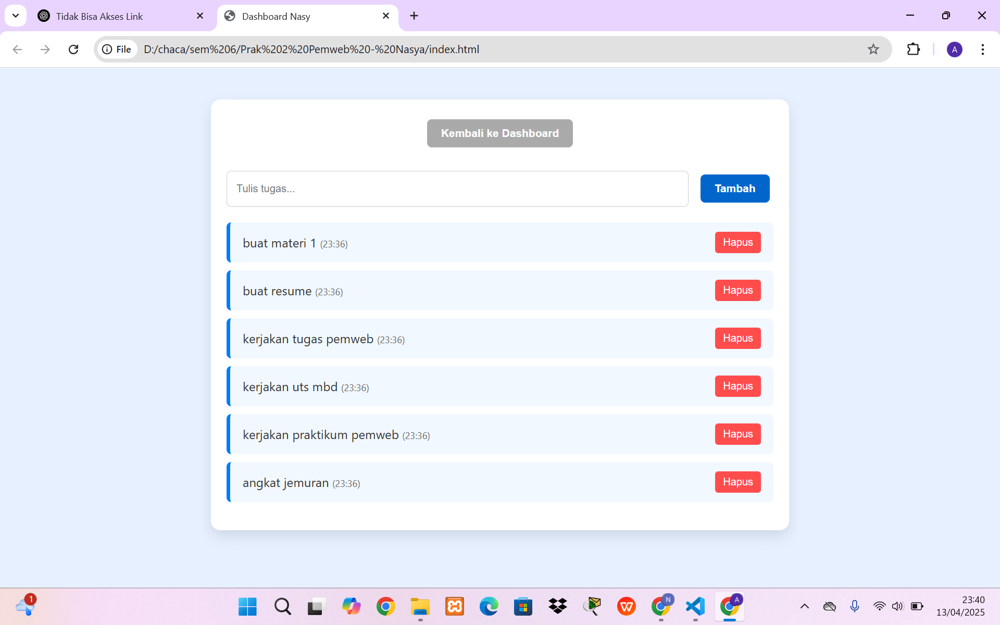

# 💻 Personal Dashboard – Nasy

Aplikasi personal dashboard ini dibuat sebagai bagian dari tugas UTS mata kuliah **Pemrograman Web Lanjut**. Aplikasi ini sederhana namun interaktif, dengan tampilan menarik dan fitur utama berupa manajemen tugas harian.

---

## ✨ Fitur-Fitur

- **Halaman Dashboard**
  - Menampilkan gambar ilustrasi `dashboard.jpg`.
  - Tersedia tombol **"Lihat Daftar Tugas"** untuk berpindah ke halaman tugas.

- **Halaman Tugas**
  - Tambahkan tugas baru dengan menulis di input dan klik tombol "Tambah".
  - Tugas yang ditambahkan langsung tampil di daftar.
  - Setiap tugas menampilkan **jam saat ditambahkan**.
  - Tugas bisa dihapus satu per satu menggunakan tombol **"Hapus"**.
  - Tersedia tombol **"Kembali ke Dashboard"**.

---

## 📁 Struktur File
    app.js          // Logika interaktif menggunakan JavaScript
    Dashboard.jpg   // Gambar ilustrasi untuk halaman dashboard
    index.html      // Struktur HTML utama
    README.md       // Dokumentasi proyek ini
    Screenshot 2025-04-13 234008.png  // Gambar tampilan list catatan/tugas
    style.css       // File untuk styling tampilan

---

## 🎨 Desain Tampilan

- Background halaman menggunakan warna biru muda `#e6f0ff`.
- Gambar dashboard berukuran sedang dan berada di tengah layar.
- Tampilan tombol dan teks responsif serta mudah digunakan.
- Gaya tombol berubah saat di-hover.

---

## 🧰 Teknologi yang Digunakan

- HTML5
- CSS3
- JavaScript (Vanilla JS, tanpa framework)

---

## 📸 Screenshot Tampilan

> Gambar tampilan awal (dashboard):

 

---

## 🧑‍💻 Cara Menjalankan

1. Pastikan semua file (`index.html`, `style.css`, `app.js`, `dashboard.jpg`) berada dalam satu folder.
2. Buka file `index.html` di browser dengan cara **double click** atau **drag ke tab browser**.
3. Klik tombol "Lihat Daftar Tugas" untuk menggunakan fitur task list.

---

## 🙌 Penutup

Aplikasi ini dibuat sebagai latihan dan implementasi dari penggunaan HTML, CSS, dan JavaScript dalam pembuatan aplikasi berbasis web sederhana.

