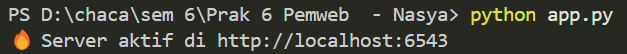
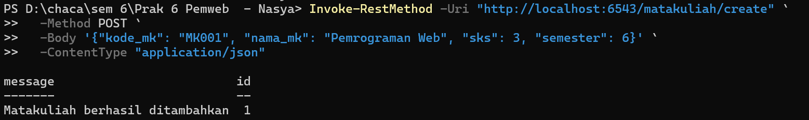
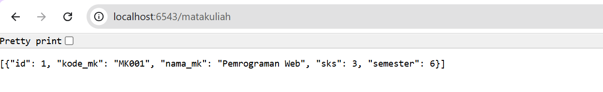

Aplikasi Manajemen Matakuliah (Pyramid REST API)

📌 Deskripsi

    Aplikasi ini merupakan REST API sederhana untuk manajemen data matakuliah menggunakan Python, Pyramid Framework, dan SQLAlchemy.

    Fitur yang tersedia:
    * Tambah matakuliah (`POST`)
    * Tampilkan semua matakuliah (`GET`)
    * Perbarui matakuliah (`PUT`)
    * Hapus matakuliah (`DELETE`)

📁 Struktur File
    ├── app.py                # Aplikasi utama Pyramid
    ├── models.py             # Model Matakuliah dengan SQLAlchemy
    ├── initialize_db.py      # Script untuk inisialisasi database SQLite
    ├── matakuliah.db         # (Akan dibuat otomatis saat pertama kali run)

🧰 Requirements
* Python 3.12 atau lebih baru
* Virtualenv (opsional tapi direkomendasikan)


⚙️ Instalasi

#### 1. Masuk ke folder proyek
cd "D:\chaca\sem 6\Prak 6 Pemweb - Nasya"

#### 2. Install dependency
python -m pip install pyramid sqlalchemy waitress pyramid_tm zope.sqlalchemy

### 🗃️ Setup Database
Menjalankan script ini sekali untuk membuat database SQLite:
python initialize_db.py

### 🚀 Menjalankan Server
Setelah database siap, kita menjalankan aplikasi dengan:
python app.py

Jika berhasil, akan muncul:
🔥 Server aktif di http://localhost:6543


### 🔌 Testing API
Saya menggunakan PowerShell untuk mengakses:

#### 🔹 GET semua matakuliah
http://localhost:6543/matakuliah

#### 🔹 POST tambah matakuliah (PowerShell)
```
Invoke-RestMethod -Uri "http://localhost:6543/matakuliah/create" `
  -Method POST `
  -Body '{"kode_mk": "MK001", "nama_mk": "Pemrograman Web", "sks": 3, "semester": 6}' `
  -ContentType "application/json"
```
  
  

#### 🔹 PUT update matakuliah
```
Invoke-RestMethod -Uri "http://localhost:6543/matakuliah/1" `
  -Method PUT `
  -Body '{"nama_mk": "Pemrograman Web Lanjut"}' `
  -ContentType "application/json"
```

#### 🔹 DELETE matakuliah
```powershell
Invoke-RestMethod -Uri "http://localhost:6543/matakuliah/1" `
  -Method DELETE
```

### 📦 Catatan Tambahan
* Database menggunakan SQLite untuk kemudahan (bisa diganti PostgreSQL)
* Belum menggunakan Alembic (migrasi manual via SQLAlchemy)
* Validasi input belum ditambahkan
