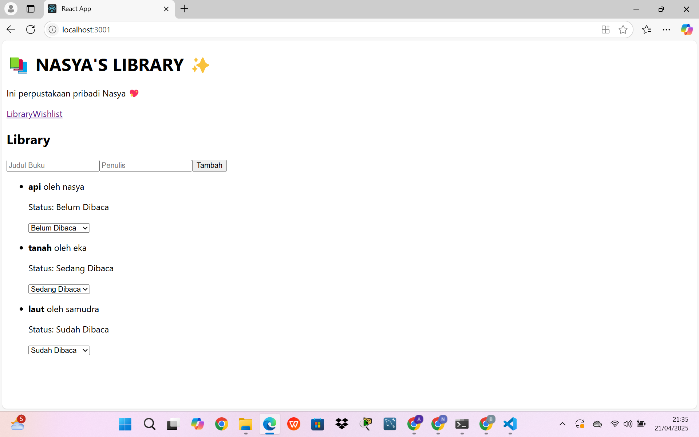
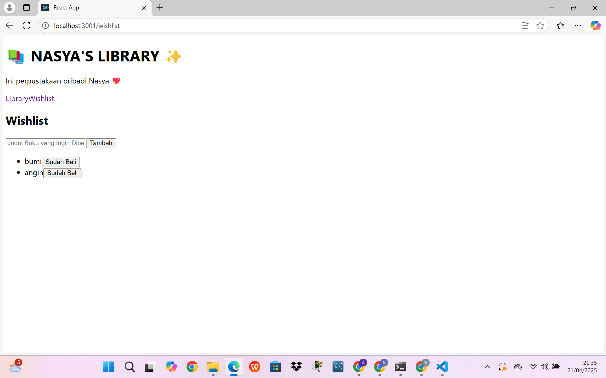
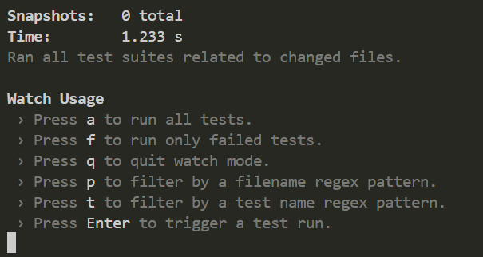

# 📚 Aplikasi Manajemen Buku – BukuKu

Aplikasi manajemen buku sederhana berbasis **React**. Aplikasi ini memiliki dua fitur utama:
1. **Library** – untuk mencatat buku yang dimiliki dan mengatur status baca.
2. **Wishlist** – untuk mencatat buku yang ingin dibeli.

Desain antarmuka menggunakan **Tailwind CSS** untuk tampilan yang rapi dan responsif. Dibuat untuk memenuhi tugas React Praktikum.

---

## 🚀 Instalasi & Menjalankan Aplikasi

1. **Clone repository** (jika dari GitHub):
    git clone https://github.com/username/bukuku-app.git
    cd bukuku-app
2. **Install Dependencies**
    npm install
3. **Jalankan Aplikasi di Lokal**
    npm start
4. **Akses Aplikasi**  
   Buka browser dan kunjungi `http://localhost:3000` untuk melihat aplikasi berjalan.

## 🖼️ Screenshot Antarmuka
*Halaman Library*: 

*Halaman Wishlist*: 

## ⚙️ Fitur React yang Digunakan
- Functional Components
    Semua komponen ditulis dalam bentuk fungsi (bukan class). Komponen ini memanfaatkan React Hooks untuk mengelola state dan efek samping.
- React Hooks
    *useState*: menyimpan state lokal seperti daftar buku.
    *useEffect*: untuk memuat dan menyimpan data ke localStorage.
    *Custom Hooks*: useBooks dan useWishlist mengelola logika state buku dan wishlist.
- React Router v6
    *Navigasi antar halaman*: /library dan /wishlist.
    Digunakan BrowserRouter, Route, Routes, dan Link.
- PropTypes
    Digunakan untuk memastikan bahwa komponen menerima props dengan tipe yang benar dan membantu dalam pengembangan yang lebih aman.

## 🧠 Komentar Kode Penting

// Menyimpan data ke localStorage saat ada perubahan
useEffect(() => {
  localStorage.setItem('books', JSON.stringify(books));
}, [books]);

// Validasi input form sebelum menambahkan buku
if (!title.trim() || !author.trim()) {
  setError('Judul dan Penulis harus diisi!');
  return;
}

## 🧪 Laporan Testing
Aplikasi diuji menggunakan React Testing Library.

Hasil Testing
✅ Menambahkan buku dengan data lengkap berhasil
✅ Menambahkan buku dengan field kosong/tidak lengkap akan ditolak
✅ Mengubah status baca buku berhasil
✅ Menambahkan dan menghapus wishlist berjalan dengan baik

Screenshot Hasil Test: 